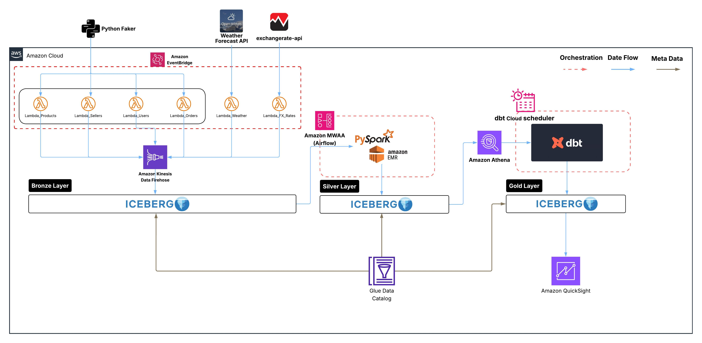
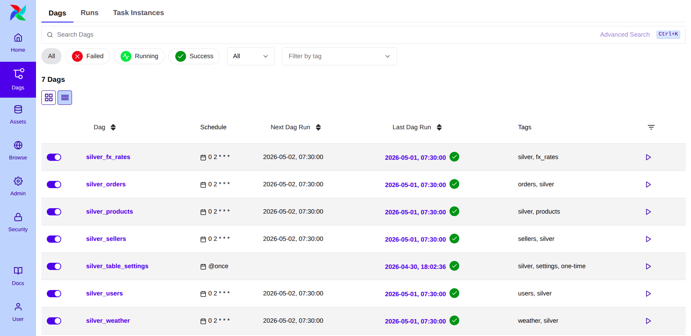
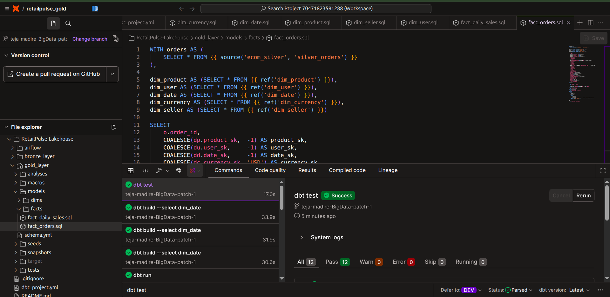
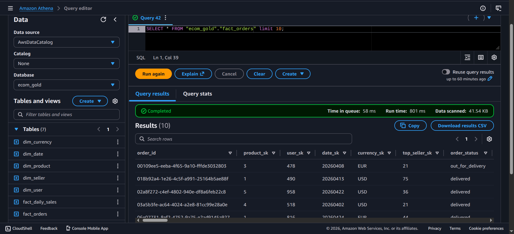

# RetailPulse — Unified Retail Analytics Lakehouse

A production-grade, end-to-end data lakehouse built on AWS using **Medallion Architecture** (Bronze → Silver → Gold). RetailPulse simulates a real-world e-commerce platform with 6 data sources, automated ingestion, PySpark transformations, dbt Cloud modelling, and a fully queryable star schema — all on Apache Iceberg.

---

## Architecture



### Data Flow

```
EventBridge (scheduled)
    → Lambda extractors (6 functions)
        → Kinesis Firehose (dynamic routing)
            → Bronze Iceberg (S3, append-only)
                → Airflow 3.0 MWAA (02:00 UTC)
                    → EMR PySpark (SCD Type 1 + append)
                        → Silver Iceberg (S3)
                            → dbt Cloud (03:00 UTC, Athena adapter)
                                → Gold Iceberg (star schema)
                                    → Amazon QuickSight
```

---

## Tech Stack

| Layer           | Tools                                                   |
| --------------- | ------------------------------------------------------- |
| Ingestion       | AWS Lambda, Amazon Kinesis Firehose, Amazon EventBridge |
| Storage         | Amazon S3, Apache Iceberg, AWS Glue Catalog             |
| Processing      | Apache Spark 3.5, PySpark, AWS EMR 7.12                 |
| Orchestration   | Apache Airflow 3.0 (MWAA), dbt Cloud Scheduler          |
| Transformation  | dbt Cloud (dbt-athena adapter, Iceberg materialisation) |
| Query Engine    | Amazon Athena                                           |
| Visualisation   | Amazon QuickSight                                       |
| Data Generation | Python Faker (seed=42 + datetime event seed)            |
| External APIs   | ExchangeRate-API v6, Open-Meteo Weather API             |
| Language        | Python 3.x, SQL, PySpark                                |

---

## Project Structure

```
RetailPulse-Lakehouse/
├── bronze_layer/                       # Lambda extractors + shared config
│   ├── shared_config.py                # Faker seeds, category maps, seller catalogue
│   ├── lambda_products.py              # 500 products, every 15 min
│   ├── lambda_users.py                 # 1,000 users, daily
│   ├── lambda_orders.py                # 150-200 orders, every 15 min
│   ├── lambda_sellers.py               # 100 sellers, daily
│   ├── lambda_fx_rates.py              # 20 currency pairs, daily (ExchangeRate-API)
│   ├── lambda_weather.py               # 10 cities, every 15 min (Open-Meteo)
│   ├── bronze_table_ddls.sql           # Athena DDL for all 6 Bronze Iceberg tables
│   └── requirements.txt                # Lambda dependencies (faker, boto3, requests)
│
├── silver_layer/                       # PySpark transformation jobs
│   ├── silver_utils.py                 # Shared utilities (dedup, DQ, row count)
│   ├── silver_products.py              # SCD Type 1 MERGE INTO
│   ├── silver_users.py                 # SCD Type 1 + name/email/phone cleaning
│   ├── silver_orders.py                # Idempotent append + DQ checks
│   ├── silver_sellers.py               # SCD Type 1 + seller_tier derived
│   ├── silver_fx_rates.py              # Append (time-series)
│   ├── silver_weather.py               # Append (time-series)
│   ├── silver_table_settings.py        # One-time: set write.object-storage.enabled=false
│   └── silver_table_ddls.sql           # Athena DDL for all 6 Silver Iceberg tables
│
├── airflow/
│   └── dags/                           # Airflow 3.0 MWAA DAGs
│       ├── silver_products_dag.py
│       ├── silver_users_dag.py
│       ├── silver_orders_dag.py
│       ├── silver_sellers_dag.py
│       ├── silver_fx_rates_dag.py
│       ├── silver_weather_dag.py
│       └── silver_table_settings_dag.py  # One-time DAG (@once) to run table settings
│
├── gold_layer/                         # dbt Cloud project
│   ├── dbt_project.yml
│   ├── models/
│   │   ├── schema.yml
│   │   ├── dims/
│   │   │   ├── dim_product.sql
│   │   │   ├── dim_user.sql
│   │   │   ├── dim_seller.sql
│   │   │   ├── dim_date.sql
│   │   │   └── dim_currency.sql
│   │   └── facts/
│   │       ├── fact_orders.sql
│   │       └── fact_daily_sales.sql
│   └── macros/
│       └── generate_schema_name.sql
│
└── docs/                               # Architecture diagram + screenshots
    ├── RetailPulse-Lakehouse.jpeg      # Architecture diagram
    ├── MWAA.png                        # Airflow 7 DAGs all green
    ├── dbt.png                         # dbt test 12/12 pass
    └── athena_gold.png                 # Athena Gold layer query results
```

---

## Bronze Layer

**6 data sources ingested via AWS Lambda → Kinesis Firehose → Apache Iceberg:**

| Table               | Source                       | Schedule     | Volume                |
| ------------------- | ---------------------------- | ------------ | --------------------- |
| `bronze_products` | Python Faker (seed=42)       | Every 15 min | 500 rows/run          |
| `bronze_users`    | Python Faker (seed=42)       | Daily        | 1,000 rows/run        |
| `bronze_orders`   | Python Faker (datetime seed) | Every 15 min | 150–200 new rows/run |
| `bronze_sellers`  | Python Faker (seed=42)       | Daily        | 100 rows/run          |
| `bronze_fx_rates` | ExchangeRate-API v6          | Daily        | 20 currency pairs/run |
| `bronze_weather`  | Open-Meteo API               | Every 15 min | 10 cities/run         |

**Two-seed Faker strategy:**

* `seed=42` — stable catalogue seed for products, users, sellers. Ensures consistent `product_id`, `user_id`, `seller_id` foreign keys across all tables
* Datetime event seed — new seed per run for orders and mutable state, generating genuine incremental deltas

**Firehose routing:** `dataset` field in each Lambda payload matches the Firehose dynamic prefix, routing records to the correct Iceberg table automatically.

All Bronze tables are **append-only** — no upsert logic at the Bronze layer. Firehose writes without `UniqueKeys` to prevent record collapse.

---

## Silver Layer

**6 PySpark jobs on AWS EMR 7.12 (Spark 3.5.6), orchestrated by Airflow 3.0 MWAA:**



| Table               | Strategy               | Key Transformations                                                          |
| ------------------- | ---------------------- | ---------------------------------------------------------------------------- |
| `silver_products` | SCD Type 1 MERGE INTO  | `price_vs_base`,`price_band`,`seller_id`                               |
| `silver_users`    | SCD Type 1 MERGE INTO  | Name split, email validation, phone cleaning,`account_age_days`            |
| `silver_orders`   | Idempotent append + DQ | `has_discount`,`order_value_band`,`days_to_delivery`,`top_seller_id` |
| `silver_sellers`  | SCD Type 1 MERGE INTO  | `seller_tier`(from rating),`account_age_days`,`fulfillment_band`       |
| `silver_fx_rates` | Append (time-series)   | DQ: 20 pairs validated, rates > 0                                            |
| `silver_weather`  | Append (time-series)   | DQ: 10 cities, temperature range validation                                  |

**Airflow 3.0 key patterns:**

* `EmrAddStepsOperator` + `EmrStepSensor` with `target_states=["COMPLETED"]` and `failed_states=["FAILED","CANCELLED","INTERRUPTED"]`
* `logical_date - macros.timedelta(days=1)` for correct yesterday's partition targeting
* `--run_timestamp {{ logical_date.isoformat() }}` passed from Airflow to PySpark for lineage

---

## Gold Layer

**7 dbt Cloud models building a star schema on Apache Iceberg via Amazon Athena:**





### Dimensional Model

```
                    ┌─────────────┐
                    │  dim_date   │
                    └──────┬──────┘
                           │
┌─────────────┐    ┌───────┴───────┐    ┌───────────────┐
│ dim_product │────│  fact_orders  │────│   dim_user    │
└─────────────┘    └───────┬───────┘    └───────────────┘
                           │
┌─────────────┐    ┌───────┴──────────┐  ┌─────────────┐
│ dim_seller  │────│ fact_daily_sales │  │dim_currency │
└─────────────┘    └──────────────────┘  └─────────────┘
```

| Model                | Source                             | Key Metric                                      |
| -------------------- | ---------------------------------- | ----------------------------------------------- |
| `dim_product`      | silver_products                    | `price_band`(budget/mid-range/premium/luxury) |
| `dim_user`         | silver_users (excl. suspended)     | `spend_segment`,`account_age_segment`       |
| `dim_seller`       | silver_sellers (excl. suspended)   | `seller_tier`,`fulfillment_band`            |
| `dim_date`         | Generated spine from silver_orders | `is_weekend`,`is_holiday_season`            |
| `dim_currency`     | silver_fx_rates (latest rate)      | `usd_exchange_rate`(daily FX)                 |
| `fact_orders`      | silver_orders + all dims           | `order_total_usd`(6 currencies → USD)        |
| `fact_daily_sales` | fact_orders aggregated             | `revenue_usd`,`total_commission_usd`        |

**dbt tests:** 12 tests across all models — `not_null` and `unique` on all primary keys. All 12 passing.

**Currency normalisation:** `order_total_usd = order_total / usd_exchange_rate` normalises 6 currencies (USD/EUR/GBP/INR/AED/SGD) to USD for accurate cross-currency revenue reporting.

---

## QuickSight Dashboards

**3 interactive dashboards built on Gold Iceberg tables via Amazon Athena:**

### Dashboard 1 — Revenue Analytics

Source: `fact_daily_sales` + `dim_date`

* Daily revenue trend line (`revenue_usd` over `order_date`)
* Revenue by product category (top_category vs revenue_usd)
* Revenue by channel (web / mobile_app / third_party)
* Revenue by country (`user_country` vs `revenue_usd`)

### Dashboard 2 — Customer & Seller Intelligence

Source: `fact_orders` + `dim_user` + `dim_seller`

* Orders by customer tier (bronze/silver/gold/platinum)
* Spend segment distribution (low/medium/high/vip)
* Top sellers by revenue (`top_seller_name` vs `order_total_usd`)
* Seller tier vs average commission rate

### Dashboard 3 — Operations Overview

Source: `fact_daily_sales`

* Order status breakdown (delivered/cancelled/refunded/returned)
* Discount rate trend over time (`discount_rate_pct`)
* Weekend vs weekday order volume (`is_weekend`)
* Total commission earned by seller category (`total_commission_usd`)

---

## Key Engineering Decisions

**Bronze = append-only:** Firehose `UniqueKeys` caused catastrophic data collapse (all records upserted to one row). Removing it entirely was the correct fix — upsert logic belongs exclusively in Silver.

**Two-seed Faker strategy:** Using `seed=42` for the catalogue and a datetime-based seed for events ensures stable foreign-key joins while generating genuine incremental data each run — simulating realistic production ingestion patterns.

**Airflow 3.0 temporal semantics:** `logical_date` is run time, not data interval start. Using `logical_date - macros.timedelta(days=1)` correctly targets yesterday's completed partition.

**dbt Cloud scheduler over Airflow HTTP trigger:** Silver runs at 02:00 UTC via Airflow. Gold runs at 03:00 UTC via dbt Cloud's built-in scheduler. Each tool handles what it's best at — no NAT Gateway required, no HTTP connections to manage.

**Apache Iceberg across all 3 layers:** Schema evolution, time travel, MERGE INTO support, and partition pruning — consistent open table format throughout the stack.

---

## AWS Infrastructure

| Service            | Purpose                                          |
| ------------------ | ------------------------------------------------ |
| S3                 | Data lake storage for all 3 layers               |
| AWS Lambda         | Scheduled data extractors (6 functions)          |
| Amazon EventBridge | Schedules Lambda execution                       |
| Kinesis Firehose   | Streaming ingestion with dynamic Iceberg routing |
| AWS EMR 7.12       | PySpark cluster for Silver transformations       |
| Amazon MWAA        | Managed Airflow 3.0 for DAG orchestration        |
| AWS Glue Catalog   | Shared metadata store for all Iceberg tables     |
| Amazon Athena      | SQL query engine for dbt and ad-hoc analysis     |
| dbt Cloud          | Gold layer transformation and scheduling         |

---

## Setup & Deployment

### Prerequisites

* AWS account with permissions for S3, Lambda, EMR, MWAA, Firehose, Glue, Athena
* dbt Cloud account (free tier works)
* Python 3.9+

### 1. Bronze Layer

```bash
# Create Bronze Iceberg tables in Athena
# Run ddl/bronze_table_ddls.sql

# Deploy Lambda functions
cd bronze_layer/
# Package and deploy each lambda_*.py with shared_config.py as a layer

# Create EventBridge rules
aws events put-rule --name "retailpulse-products-15min" \
  --schedule-expression "rate(15 minutes)" --region ap-south-2
```

### 2. Silver Layer

```bash
# Create Silver Iceberg tables in Athena
# Run ddl/silver_table_ddls.sql

# Upload PySpark scripts to S3
aws s3 cp silver_layer/ s3://your-bucket/silver_layer/ --recursive

# Upload DAGs to MWAA
aws s3 cp airflow/dags/ s3://your-mwaa-bucket/dags/ --recursive

# Set Airflow Variables
# emr_cluster_id = your-emr-cluster-id
# emr_s3_bucket_name = your-bucket-name
```

### 3. Gold Layer

```bash
# Connect dbt Cloud to this repo
# Set dbt project root to: gold_layer/
# Configure Athena connection in dbt Cloud

# Run models
dbt run
dbt test
```

---

## Data Quality

All Silver jobs include DQ assertions before writing:

* Row count validation (minimum expected rows per source)
* Null checks on primary keys
* Range validation (ratings 1.0–5.0, fulfillment scores 0–100, FX rates > 0)
* Duplicate detection with Window-based deduplication

All Gold models include dbt tests:

* `not_null` + `unique` on all surrogate keys and primary keys

---

## Author

**Teja Madire** — Data Engineer

* GitHub: [github.com/teja-madire-BigData](https://github.com/teja-madire-BigData)
* LinkedIn: [linkedin.com/in/teja-madire](https://linkedin.com/in/teja-madire)
